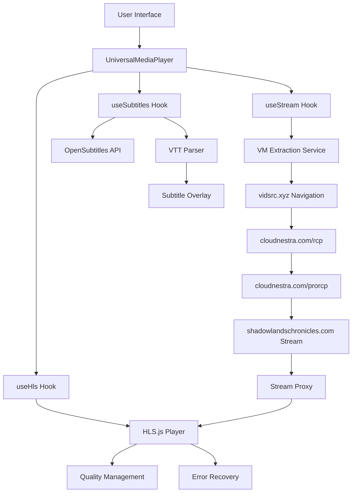

# Design Document

## Overview

The media playback fixes will address critical issues in the Flyx streaming application by implementing a robust, multi-layered approach to stream extraction, HLS video playback, and subtitle synchronization. The system must handle the complex iframe embedding architecture used by pirate sites (particularly vidsrc.xyz's multi-layered cloudnestra.com system) while providing smooth, error-resilient video playback with accurate subtitle display.

The solution involves enhancing three core components:
1. **VM-based extraction service** - Improved stealth techniques and iframe navigation
2. **Frontend HLS player** - Enhanced error recovery and quality management  
3. **Subtitle system** - Better parsing, synchronization, and display

## Architecture

### High-Level System Flow

```
User Request → Frontend → VM Extraction Service → Pirate Site Navigation → Stream URL → HLS Player → Video Playback
                ↓
            Subtitle Service → OpenSubtitles API → VTT Processing → Overlay Display
```

### Component Interaction Diagram



## Components and Interfaces

### 1. Enhanced VM Extraction Service

#### Core Improvements
- **Multi-layered iframe navigation**: Handle vidsrc.xyz → cloudnestra.com/rcp → cloudnestra.com/prorcp chain
- **Enhanced stealth techniques**: Improved anti-bot detection bypass
- **Server hash rotation**: Automatic fallback between CloudStream Pro, 2Embed, Superembed
- **Play button simulation**: Realistic human-like interaction with cloudnestra play buttons

#### Key Methods
```javascript
// Enhanced iframe navigation
async function navigateIframeChain(page, logger) {
  // Navigate through vidsrc.xyz → cloudnestra.com chain
  // Handle encoded hash parameters
  // Simulate play button clicks (#pl_but)
  // Extract final stream URL from shadowlandschronicles.com
}

// Server hash fallback system
async function tryServerHashes(movieId, seasonId, episodeId, logger) {
  const servers = ['CloudStream Pro', '2Embed', 'Superembed'];
  // Try each server hash until successful extraction
}

// Enhanced stealth configuration
function getEnhancedStealthConfig() {
  return {
    // Improved user agent rotation
    // Enhanced localStorage manipulation
    // Better mouse movement simulation
    // Realistic timing delays
  };
}
```

#### Interface Updates
```javascript
// Enhanced extraction response
{
  success: boolean,
  streamUrl: string,
  streamType: 'hls' | 'mp4',
  server: string,
  serverHash: string,
  extractionMethod: 'direct' | 'iframe_chain',
  requiresProxy: boolean,
  subtitles: Array<SubtitleInfo>,
  debug: {
    iframeChain: string[],
    serverAttempts: string[],
    extractionTime: number
  }
}
```

### 2. Enhanced HLS Player (useHls Hook)

#### Core Improvements
- **Aggressive segment skipping**: Skip corrupted segments within 2 seconds
- **Progressive error recovery**: Multi-stage recovery before full restart
- **Enhanced gap jumping**: Smart buffer gap detection and jumping
- **Quality maintenance**: Prevent unnecessary quality oscillation

#### Key Enhancements
```javascript
// Enhanced HLS configuration
const hlsConfig = {
  // Aggressive error recovery
  fragLoadingMaxRetry: 1,
  fragLoadingRetryDelay: 500,
  fragLoadingMaxRetryTimeout: 5000,
  
  // Enhanced buffering
  maxBufferLength: 60,
  maxBufferSize: 60 * 1000 * 1000,
  
  // Quality stability
  abrBandWidthFactor: 0.8,
  abrBandWidthUpFactor: 0.7,
  
  // Disable native subtitles completely
  renderTextTracksNatively: false,
  subtitleTrackController: false,
  subtitleDisplay: false
};

// Enhanced error handling
function handleSegmentError(frag, errorCount) {
  if (errorCount >= 1) {
    // Immediate segment skip for faster recovery
    skipSegment(frag);
  }
}

// Progressive recovery system
function handleFatalError(hlsInstance, errorData) {
  switch(errorData.type) {
    case 'networkError':
      return attemptNetworkRecovery(hlsInstance);
    case 'mediaError':
      return attemptMediaRecovery(hlsInstance, errorData);
    default:
      return attemptFullRestart(hlsInstance);
  }
}
```

### 3. Enhanced Subtitle System

#### Core Improvements
- **Improved VTT parsing**: Better handling of malformed subtitle files
- **Enhanced synchronization**: Sub-100ms accuracy with video playback
- **Robust error handling**: Graceful fallback when subtitle loading fails
- **Multi-language support**: Seamless switching between subtitle languages

#### Key Components
```javascript
// Enhanced VTT parser
function parseVTT(vttText) {
  // Improved line parsing with better error handling
  // Support for various VTT format variations
  // Enhanced time parsing (HH:MM:SS.mmm and MM:SS.mmm)
  // HTML tag sanitization
  // Cue validation and error recovery
}

// Subtitle synchronization engine
function updateSubtitleDisplay(currentTime, subtitleCues) {
  // High-frequency updates (every 100ms)
  // Accurate time matching with tolerance
  // Smooth subtitle transitions
  // Performance optimization for large subtitle files
}

// Multi-language management
function manageSubtitleLanguages(availableSubtitles) {
  // Language priority system
  // Automatic fallback to available languages
  // Blob URL management and cleanup
  // Cache optimization
}
```

### 4. Stream Proxy Service

#### Purpose
Handle CORS restrictions for shadowlandschronicles.com streams and provide failover capabilities.

#### Implementation
```javascript
// Enhanced proxy configuration
app.get('/api/stream-proxy', async (req, res) => {
  const { url, source } = req.query;
  
  // Enhanced header management for different sources
  const headers = getSourceSpecificHeaders(source);
  
  // Implement retry logic with exponential backoff
  const response = await retryRequest(url, headers, 3);
  
  // Stream the response with proper CORS headers
  streamResponse(response, res);
});

function getSourceSpecificHeaders(source) {
  switch(source) {
    case 'shadowlandschronicles':
      return {
        'User-Agent': 'Mozilla/5.0 (Windows NT 10.0; Win64; x64) AppleWebKit/537.36',
        'Referer': 'https://cloudnestra.com/',
        'Origin': 'https://cloudnestra.com'
      };
    default:
      return getDefaultHeaders();
  }
}
```

## Data Models

### Stream Extraction Data
```typescript
interface StreamExtractionResult {
  success: boolean;
  streamUrl: string;
  streamType: 'hls' | 'mp4';
  server: string;
  serverHash?: string;
  extractionMethod: 'direct' | 'iframe_chain';
  requiresProxy: boolean;
  quality: {
    available: string[];
    default: string;
  };
  subtitles: SubtitleInfo[];
  debug: {
    iframeChain: string[];
    serverAttempts: string[];
    extractionTime: number;
    stealthBypass: boolean;
  };
}
```

### Enhanced Subtitle Data
```typescript
interface SubtitleInfo {
  id: string;
  language: string;
  languageCode: string;
  blobUrl: string;
  source: 'opensubtitles' | 'embedded' | 'extracted';
  quality: number;
  format: 'vtt' | 'srt';
  cueCount: number;
  duration: number;
}

interface SubtitleCue {
  start: number;
  end: number;
  text: string;
  id?: string;
}
```

### HLS Player State
```typescript
interface HLSPlayerState {
  qualities: QualityLevel[];
  currentQuality: string;
  bufferHealth: number;
  errorCount: number;
  recoveryAttempts: number;
  segmentErrors: Map<string, number>;
  lastRecoveryTime: number;
}

interface QualityLevel {
  id: number;
  height: number;
  bitrate: number;
  label: string;
  bandwidth: number;
  sortedIndex: number;
}
```

## Error Handling

### Error Classification System
```javascript
const ErrorTypes = {
  EXTRACTION: {
    IFRAME_NAVIGATION_FAILED: 'iframe_navigation_failed',
    SERVER_HASH_EXHAUSTED: 'server_hash_exhausted',
    ANTI_BOT_DETECTED: 'anti_bot_detected',
    PLAY_BUTTON_NOT_FOUND: 'play_button_not_found'
  },
  PLAYBACK: {
    HLS_FATAL_ERROR: 'hls_fatal_error',
    SEGMENT_LOAD_FAILED: 'segment_load_failed',
    BUFFER_STALLED: 'buffer_stalled',
    QUALITY_SWITCH_FAILED: 'quality_switch_failed'
  },
  SUBTITLE: {
    VTT_PARSE_ERROR: 'vtt_parse_error',
    SYNC_DRIFT: 'sync_drift',
    BLOB_URL_FAILED: 'blob_url_failed',
    LANGUAGE_SWITCH_FAILED: 'language_switch_failed'
  }
};
```

### Recovery Strategies
```javascript
const RecoveryStrategies = {
  // Extraction failures
  [ErrorTypes.EXTRACTION.IFRAME_NAVIGATION_FAILED]: async (context) => {
    // Try alternative iframe navigation methods
    // Attempt direct hash decoding
    // Fallback to different server
  },
  
  // Playback failures
  [ErrorTypes.PLAYBACK.HLS_FATAL_ERROR]: async (context) => {
    // Progressive recovery: restart load → media recovery → full restart
    // Preserve playback position
    // Switch to lower quality if needed
  },
  
  // Subtitle failures
  [ErrorTypes.SUBTITLE.VTT_PARSE_ERROR]: async (context) => {
    // Attempt alternative parsing methods
    // Fallback to different subtitle source
    // Disable subtitles gracefully
  }
};
```

## Testing Strategy

### Unit Testing
- **VTT Parser**: Test with various subtitle formats and malformed files
- **HLS Error Recovery**: Simulate different error scenarios
- **Stream Extraction**: Mock pirate site responses and iframe chains

### Integration Testing
- **End-to-end playback**: Test complete flow from extraction to playback
- **Subtitle synchronization**: Verify timing accuracy across different content
- **Error recovery**: Test recovery mechanisms under various failure conditions

### Performance Testing
- **Buffer management**: Test under different network conditions
- **Quality switching**: Verify smooth transitions between quality levels
- **Memory usage**: Monitor for memory leaks in long playback sessions

### Browser Compatibility Testing
- **HLS.js support**: Test across different browsers and versions
- **Subtitle rendering**: Verify consistent display across platforms
- **Error handling**: Ensure graceful degradation on unsupported browsers

## Security Considerations

### Anti-Detection Measures
- **User agent rotation**: Regularly update user agent strings
- **Behavioral simulation**: Realistic mouse movements and timing
- **Fingerprint masking**: Hide automation indicators
- **Request throttling**: Avoid suspicious request patterns

### CORS and Proxy Security
- **Origin validation**: Verify requests come from legitimate sources
- **Rate limiting**: Prevent abuse of proxy endpoints
- **Header sanitization**: Clean potentially malicious headers
- **URL validation**: Ensure proxy only accesses approved domains

### Data Privacy
- **No logging of user content**: Avoid storing sensitive viewing data
- **Secure subtitle handling**: Properly clean up blob URLs
- **Error reporting**: Sanitize error messages to avoid data leaks

## Performance Optimizations

### Stream Loading
- **Parallel processing**: Load stream and subtitles simultaneously
- **Caching strategies**: Cache successful extraction results
- **Connection pooling**: Reuse connections for better performance
- **Compression**: Use gzip/brotli for subtitle and metadata transfer

### Memory Management
- **Blob URL cleanup**: Automatic cleanup of subtitle blob URLs
- **Buffer optimization**: Intelligent buffer size management
- **Event listener cleanup**: Proper cleanup of HLS event listeners
- **Garbage collection**: Minimize memory leaks in long sessions

### Network Optimization
- **Request batching**: Combine multiple API calls where possible
- **CDN utilization**: Use CDN for static assets
- **Connection keep-alive**: Maintain persistent connections
- **Retry strategies**: Exponential backoff for failed requests